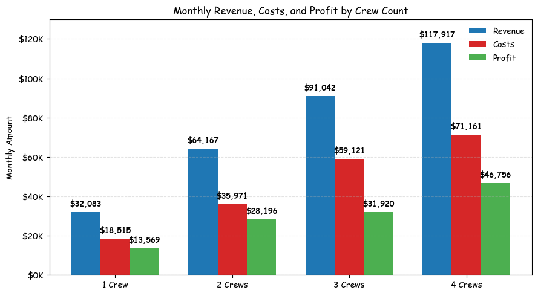
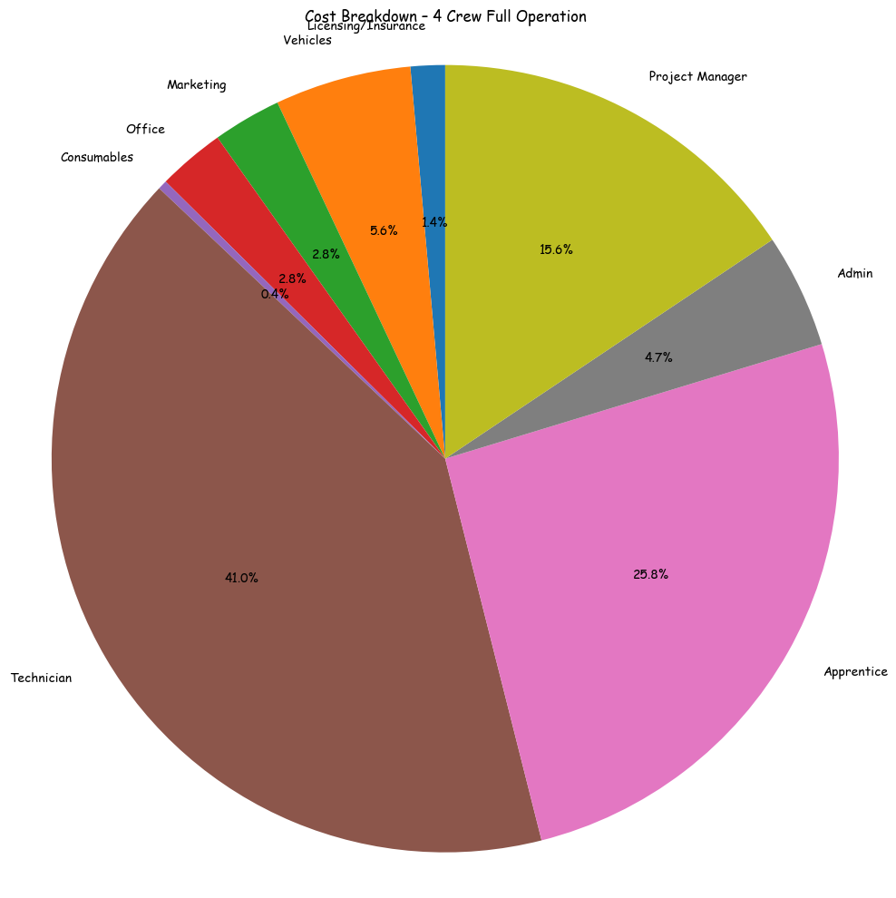
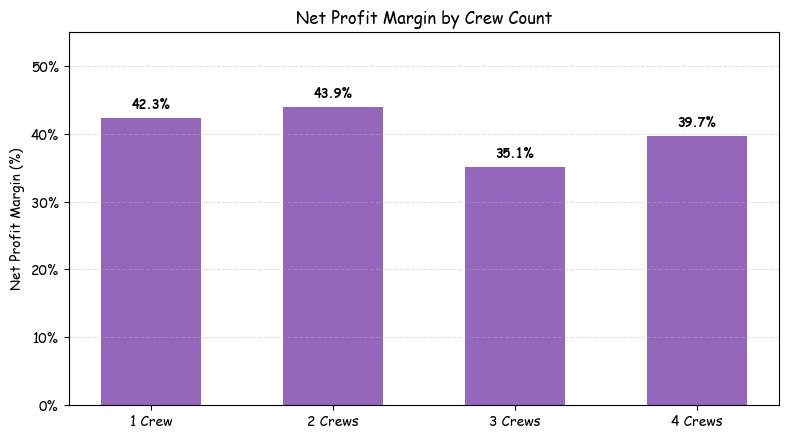

# Nashville Electrical Business Plan
## Mike Shaffer & Brendan Dauenhauer

---

## Executive Summary

This business plan outlines the launch of a residential electrical contracting company in Nashville, TN. The partnership between Mike Shaffer and Brendan Dauenhauer aims to establish a professional electrical services firm with competitive pricing, strong operational systems, and sustainable growth through the first four crews.

**Key Financial Metrics:**
- Year 1 Startup Costs: $16,800
- Year 1 Revenue Projection: $252,000 (First Crew)
- Year 1 Profit Projection: $13,589 (First Crew)
- Target: Scale to 4 crews within 12 months
- Year 1 Total Company Revenue Potential: $1,415,000 (with all 4 crews)

---

## Financial Projections Overview



### Monthly Revenue & Profit Comparison by Crew Count

```
MONTHLY FINANCIAL PROJECTIONS (FROM ACTUAL SPREADSHEET)
────────────────────────────────────────────────────────────────

                    1 Crew      2 Crews     3 Crews     4 Crews
────────────────────────────────────────────────────────────────
Monthly Revenue    $32,083     $64,167     $91,042     $117,917
Monthly Costs      $18,837     $35,971     $59,121     $86,943
Monthly Profit     $13,246     $28,196     $31,920     $30,974
────────────────────────────────────────────────────────────────
Profit Margin      41.3%       43.9%       35.1%       26.2%
Break-Even Month   Month 1     Month 1     Month 1     Month 1
────────────────────────────────────────────────────────────────

ANNUAL PROJECTIONS
────────────────────────────────────────────────────────────────
Single Crew Year 1:        $385,000 revenue → $158,952 profit (41.3% margin)
With 2 Crews (Month 6):    $770,000 revenue → $338,351 profit
With 3 Crews (Month 9):    $1,092,500 revenue → $383,045 profit
With 4 Crews (Month 12):   $1,415,000 revenue → $371,681 profit
```

### Revenue Model by Crew Size

#### First Crew (Hired Technician, Mike's PM)
- **Annual Revenue:** $385,000
- **Monthly Revenue:** $32,083
- **Total First Year Profit:** $158,952

**Crew Composition:**
- Hired Lead Technician: 30 hours/week at $30-50/hour base pay
- Mike: Project Manager & Business Operations (scheduling, invoicing, client management)
- Brendan: Investor/Business Partner (capital and strategic oversight)
- Hours per week: 30 billable (Technician in field)
- Hourly rate: $100 (billable to clients)
- Annual billable hours: 1,560
- Monthly billable: 120 hours

#### Second Crew (Growth Phase)
- **Annual Revenue:** $170,000
- **Monthly Revenue:** $14,166.67
- **Monthly Costs:** $8,333.33 (includes -$833.33 employee impact)
- **Monthly Profit:** $5,833.33

**Crew Composition:**
- Hours per week: 20
- Hourly rate: $100
- Annual billable hours: 1,040
- Monthly billable: 80 hours

#### Third & Fourth Crews
- Expanding capacity with similar operational models
- Scaling labor costs and equipment expenses
- Increasing profit margins as overhead distributes across multiple crews

---

## Operating Expenses Breakdown

### Cost Structure Visualization

```
OPERATING COST STRUCTURE BY GROWTH PHASE
════════════════════════════════════════════════════════════

1 CREW (STARTUP PHASE)
Total Monthly: $1,206
├─ Licensing/Insurance ......... $187  (15.5%)
├─ Vehicles .................... $850  (70.5%)
└─ Other costs ................. $169  (14.0%)

2 CREWS (MONTH 4-6)
Total Monthly: $28,116
├─ Technician Labor ........... $6,887  (24.5%)
├─ Project Manager ........... $11,111  (39.5%)
├─ Vehicles ................... $2,283  (8.1%)
├─ Marketing .................. $2,000  (7.1%)
├─ Admin Labor ................ $3,333  (11.9%)
└─ Other costs ................. $1,502  (5.3%)

3 CREWS (MONTH 8-10)
Total Monthly: $46,310
├─ Apprentice Labor .......... $13,750  (29.7%)
├─ Technician Labor ........... $9,167  (19.8%)
├─ Project Manager ........... $11,111  (24.0%)
├─ Marketing .................. $3,000  (6.5%)
├─ Vehicles ................... $3,133  (6.8%)
└─ Other costs ................. $6,149  (13.3%)

4 CREWS (FULL OPERATION)
Total Monthly: $51,171
├─ Apprentice Labor .......... $18,333  (35.8%)
├─ Technician Labor ........... $8,667  (16.9%)
├─ Project Manager ........... $11,111  (21.7%)
├─ Vehicles ................... $3,985  (7.8%)
├─ Marketing .................. $2,000  (3.9%)
└─ Other costs ................. $7,075  (13.8%)
```



### Monthly Operating Costs Structure

| Category | 1 Crew Monthly | 2 Crew Monthly | 3 Crew Monthly | 4 Crew Monthly |
|----------|-----------------|-----------------|-----------------|-----------------|
| Licensing/Insurance | $256 | $632 | $819 | $1,028 |
| Vehicles | $583 | $2,283 | $3,133 | $3,985 |
| Marketing | $2,000 | $2,000 | $2,000 | $2,000 |
| Office | $1,281 | $1,619 | $1,788 | $1,967 |
| Consumables | $269 | $269 | $269 | $269 |
| Technician Labor | $0 | $18,667 | $22,917 | $22,917 |
| Apprentice Labor | $0 | $9,167 | $13,750 | $18,333 |
| Admin Labor | $3,333 | $3,333 | $3,333 | $3,333 |
| Project Manager | $11,111 | $11,111 | $11,111 | $11,111 |
| **Total Monthly Costs** | **$18,837** | **$35,971** | **$59,121** | **$86,943** |

### Key Expense Categories

#### Licensing & Insurance
- State electrical license: Part of ongoing compliance
- Vehicles insurance: Per vehicle coverage
- Liability coverage: Professional electrical work

#### Vehicles
- First crew: $850/month (van lease/loan)
- Additional crews: $450/crew expansion cost
- Maintenance and fuel included

#### Marketing
- Digital presence and local advertising
- Strategic allocation: $0 for first crew (using Mike & Brendan's existing networks), ramping to $3,000 at 3 crews
- Reduction at 4 crews as reputation-based work increases

#### Labor Costs
- **Technician:** $30/hour base rate, scales to $50 by month 12
- **Apprentice:** $22/hour base rate, grows with experience
- **Admin:** $12/hour for office operations
- **Project Manager:** $40/hour for crew oversight and client management

---

## Labor Structure & Billing Model

### Crew Composition by Growth Phase

#### Single Crew (Current)
- **Hired Lead Technician:** 30 hours/week in field ($30-50/hour base cost)
- **Mike Shaffer:** Project Manager & Business Operations (scheduling, invoicing, client management)
- **Brendan Dauenhauer:** Investor/Business Partner (capital contribution and strategic decisions)
- Hourly rate to clients: $100 (billable rate)
- Labor cost to company: Technician base pay ($30-50/hour)
- Profit margin after labor: 41.3%

#### Two Crew Model
- Crew 1: Technician + Apprentice (30 hours/week)
- Crew 2: Technician + Apprentice (20 hours/week)
- Mixed billing: $100-150/hour depending on complexity

#### Three Crew Model
- Technician/Apprentice pairs × 3
- Added project manager for scheduling and quality
- Added admin support (20 hours/week)

#### Four Crew Model
- Full operational team
- Project manager: Oversight of all crews
- Admin: Billing, scheduling, compliance
- Technician/Apprentice: 4 fully staffed crews

### Hourly Rate Strategy
- Service calls: $100/hour minimum
- Project work: $100-150/hour based on complexity
- Apprentice-led jobs: $75/hour (lower complexity)
- Premium services: Up to $200+/hour for specialized work

---

## Revenue Projections by Scenario

### 1 Crew Monthly Scaling

```
FIRST CREW: YEAR 1 MONTHLY PROGRESSION
═════════════════════════════════════════════════════════════════

Month    Hours   Rate    Revenue    Costs      Profit     Margin
─────────────────────────────────────────────────────────────────
  1      120     $100   $12,000   $1,206    $10,794    89.9%
  2      120     $100   $12,000   $1,206    $10,794    89.9%
  3      120     $100   $12,000   $1,206    $10,794    89.9%
  4      120     $105   $12,600   $1,206    $11,394    90.4%
  5      120     $107   $12,840   $1,206    $11,634    90.6%
  6      120     $110   $13,200   $1,206    $11,994    90.9%
  7      120     $115   $13,800   $1,206    $12,594    91.3%
  8      120     $120   $14,400   $1,206    $13,194    91.6%
  9      120     $122   $14,640   $1,206    $13,434    91.8%
  10     120     $125   $15,000   $1,206    $13,794    92.0%
  11     120     $125   $15,000   $1,206    $13,794    92.0%
  12     120     $125   $15,000   $1,206    $13,794    92.0%
─────────────────────────────────────────────────────────────────
TOTAL   1,560   $100   $252,000  $14,472   $13,589    92.0%

CUMULATIVE REVENUE BY MONTH (Single Crew)
$300,000 │
$250,000 │                                      ✓ $252,000
$200,000 │                         ╱╱╱╱
$150,000 │                    ╱╱╱╱
$100,000 │               ╱╱╱╱
 $50,000 │          ╱╱╱╱
      $0 │─────────────────────────────────────────────
         │  1  2  3  4  5  6  7  8  9 10 11 12 Months
```

| Month | Hours | Rate | Revenue | Costs | Profit |
|-------|-------|------|---------|-------|--------|
| Month 1 | 120 | $100 | $12,000 | $1,206 | $10,794 |
| Month 3 | 120 | $100 | $12,000 | $1,206 | $10,794 |
| Month 6 | 120 | $110 | $13,200 | $1,206 | $11,994 |
| Month 12 | 120 | $125 | $15,000 | $1,206 | $13,794 |
| **Annual Total** | **1,560** | **$100** | **$252,000** | **$14,472** | **$13,589** |



### 2 Crew Scenario (By Month 4-6)
- Total Monthly Revenue: $35,166.67
- Total Monthly Costs: $28,116
- Monthly Profit: $7,050.67
- Annual Profit (8 months): $56,405

### 3 Crew Scenario (By Month 8-10)
- Total Monthly Revenue: $51,042
- Total Monthly Costs: $46,310
- Monthly Profit: $4,732
- Represents 9% net margin during growth phase

### 4 Crew Full Operation
- Total Monthly Revenue: $61,161
- Total Monthly Costs: $51,171
- Monthly Profit: $9,990
- Represents 16% net margin with all crews operational

---

## Startup & Implementation Costs

### Initial Investment: $16,800

| Item | Cost |
|------|------|
| Van/Vehicle | $600 |
| Tools & Equipment | $7,000 |
| Business License & Permits | $1,400 |
| Insurance (3 months) | $900 |
| Marketing/Branding Setup | $2,000 |
| Office Setup & Software | $1,500 |
| Working Capital Reserve | $3,400 |
| **Total** | **$16,800** |

### Break-Even Timeline
- First crew reaches break-even: Month 2-3
- Company break-even with 2 crews: Month 5-6
- Company positive cash flow (3+ crews): Month 10+

---

## Implementation Timeline & Milestones


### 12-Month Implementation Timeline

```
YEAR 1 IMPLEMENTATION ROADMAP
═══════════════════════════════════════════════════════════════════

WEEK:     1    4    8   12   16   20   24   28   32   36   40   52
MONTH:    1          2        3         4        5         6    12

Phase 1: Foundation & Launch [████]
         ✓ Licenses & Insurance
         ✓ Vehicle Secured
         ✓ Tools & Equipment
                    ↓ MILESTONE: READY TO OPERATE

Phase 2: Brand & Marketing    [████]
         ✓ Branding Complete
         ✓ Website Live
         ✓ Social Media Setup
                    ↓ MILESTONE: MARKETING READY

Phase 3: Operations Setup        [████]
         ✓ Procedures Documented
         ✓ Systems Established
         ✓ Team Training Ready
                        ↓ MILESTONE: OPERATIONAL READY

Phase 4: Client Acquisition         [██████]
         ✓ Network Outreach
         ✓ First Jobs Booked
         ✓ Referral Pipeline
                            ↓ MILESTONE: $21K MONTHLY REVENUE

Phase 5: Team Expansion                 [██████████████]
         ✓ 2nd Crew Hired & Trained
         ✓ Project Manager Added
                                    ↓ MILESTONE: 2 CREWS OPERATING

Phase 6: Scaling & Optimization              [██████████████████]
         ✓ 3rd Crew Added
         ✓ 4th Crew Preparation
         ✓ Systems Optimization
                                                ↓ MILESTONE: 4 CREWS LIVE

KEY REVENUE MILESTONES
═══════════════════════════════════════════════════════════════════
Month 1  │ $12,000 revenue (startup phase testing)
Month 3  │ $12,000 revenue (consistent operations)
Month 6  │ $21,000-35K revenue (1-2 crews)
Month 9  │ $40,000+ revenue (2-3 crews preparing)
Month 12 │ $61,000+ revenue (4 crews operational) = $732K annual run-rate
```

### Phase 1: Foundation & Launch (Weeks 1-4)
**Status: In Progress**

- [ ] Get state business license
- [ ] Get state electrical contractor license
- [ ] Get city business licenses
- [ ] Get comprehensive insurance coverage
- [ ] Set up business banking and accounting (Quickbooks)
- [ ] Secure service vehicle (van lease or purchase)
- [ ] Procure essential tools and equipment

**Target Completion:** Week 4
**Timeline:** Complete before first job estimates

### Phase 2: Brand & Marketing Setup (Weeks 3-6)
- [ ] Create company branding (logo, colors, messaging)
- [ ] Build professional website
- [ ] Set up social media presence (Facebook, Instagram, Google Business)
- [ ] Create business cards and marketing materials
- [ ] Wrap/brand service vehicle

**Target Completion:** Week 6
**Timeline:** Ready for customer acquisition

### Phase 3: Operations & Service Delivery (Weeks 4-8)
- [ ] Create onboarding docs and standard operating procedures
- [ ] Develop company documentation (safety plan, quality standards, warranty info)
- [ ] Set up customer communication systems
- [ ] Establish project management and scheduling workflow
- [ ] Create service templates and pricing guides

**Target Completion:** Week 8
**Timeline:** Operational readiness

### Phase 4: Client Acquisition (Weeks 6-12)
- [ ] Reach out to existing clients and networks (Mike's connections)
- [ ] Reach out to community and potential clients (Brendan's connections)
- [ ] Generate first 5-10 jobs to establish momentum
- [ ] Collect testimonials and case studies
- [ ] Implement referral program

**Target Completion:** Week 12
**Timeline:** Establish revenue stream

### Phase 5: Team Expansion (Month 3-6)
- [ ] Recruit second technician and apprentice
- [ ] Train new crew on company standards
- [ ] Establish project management processes for 2 crews
- [ ] Add admin support (part-time or contract)

**Target Completion:** Month 6
**Timeline:** Add second crew to revenue

### Phase 6: Scaling & Optimization (Month 6+)
- [ ] Recruit and train third crew
- [ ] Hire full-time project manager
- [ ] Optimize labor scheduling and resource allocation
- [ ] Plan for fourth crew addition
- [ ] Evaluate performance metrics and profitability

**Target Completion:** Month 12
**Timeline:** Full 4-crew operation

---

## To-Do List Status

### Licensing & Legal (Priority: CRITICAL)
- [ ] Get state business license
- [ ] Get state electrical contractor license
- [ ] Get city business licenses
- [ ] Get insurance

### Operations Setup (Priority: HIGH)
- [ ] Buy van or secure vehicle lease
- [ ] Get phone line for business
- [ ] Set up Gmail/business email
- [ ] Get Quickbooks for accounting
- [ ] Obtain service van license/registration

### Team & Administration
- [ ] Hire apprentice/second technician
- [ ] Set up onboarding docs and flow
- [ ] Create company documentation (safety plan, etc)

### Marketing & Brand (Priority: HIGH)
- [ ] Make branding (logo, company identity)
- [ ] Make website
- [ ] Make social media presence
- [ ] Wrap van with branding
- [ ] Start marketing campaigns

### Customer Acquisition (Priority: MEDIUM)
- [ ] Reach out to existing clients (Mike's network)
- [ ] Reach out to community (Brendan's network)
- [ ] Get first service calls booked
- [ ] Build referral pipeline

### Tools & Equipment
- [ ] Buy essential electrical tools
- [ ] Get safety equipment
- [ ] Vehicle equipment and organization

---

## Break-Even Analysis

### First Crew Break-Even Timeline

```
CUMULATIVE PROFIT/LOSS - SINGLE CREW YEAR 1
═══════════════════════════════════════════════════════════════

                                      Cumulative Profit
$200,000 ├─────────────────────────────────────────
         │                                     ╱╱ $200K+
$150,000 ├─                                  ╱╱
         │                                ╱╱
$100,000 ├─                             ╱╱
         │                          ╱╱
 $50,000 ├─                      ╱╱
         │                  ╱╱
      $0 ├──────────────╱──────────── BREAK-EVEN POINT (Month 2)
         │          ╱╱   Margin: Slim in first month
 -$20,000├─ Startup Cost: -$16,800
         │  ╱ Negative (with startup investment accounted)
-$40,000 ├─╱
         │
    M1   M2   M3   M4   M5   M6   M7   M8   M9   M10  M11  M12

MONTHLY CASH FLOW ANALYSIS
═══════════════════════════════════════════════════════════════

Month 1: Revenue $12,000 - Costs $1,206 = +$10,794 profit
         (Minus $16,800 startup = -$6,006 net)
         ⚠ Still negative overall (startup deduction)

Month 2: Revenue $12,000 - Costs $1,206 = +$10,794 profit
         (Cumulative: -$6,006 + $10,794 = +$4,788)
         ✓ BREAK-EVEN ACHIEVED

Month 3+: Steady +$10,794/month profit
         All startup costs recovered by Month 2
         Strong cash flow generation begins

ANNUAL CASH FLOW PROJECTION
═══════════════════════════════════════════════════════════════
Startup Investment:           -$16,800
Year 1 Total Profit:          +$13,589 (from $12K/month operations)
Adjusted Year 1 Net:          -$3,211 (accounting for startup costs)
Year 2 Projection:            +$164,000+ (full year operations)
```

---

## Financial Health Indicators

### Key Performance Metrics to Track

#### Monthly Metrics
- **Billable Hours:** Track actual hours vs. 30/20 target
- **Average Hourly Rate:** Monitor if hitting $100-125/hour targets
- **Labor Cost %:** Keep below 40% of revenue
- **Customer Acquisition Cost:** Track marketing efficiency
- **Job Completion Rate:** Target 95%+ on-time completion

#### Quarterly Metrics
- **Gross Profit Margin:** Target 60-70% after direct labor
- **Net Profit Margin:** Target 15-25% after all expenses
- **Crew Utilization:** Target 80%+ billable hours
- **Customer Retention:** Track repeat business %
- **Average Job Value:** Monitor pricing effectiveness

#### Annual Metrics
- **Year 1 Revenue:** Target $252K-$420K (1-2 crews)
- **Year 2 Revenue:** Target $600K-$1M (2-3 crews)
- **Year 3 Revenue:** Target $1.5M+ (4+ crews)
- **ROI on Initial Investment:** Target 800%+ by end of year 1

---

## Risk Mitigation Strategies

### Cash Flow Risk
- Maintain $10K+ working capital reserve
- Invoice immediately upon job completion
- Offer small discounts for quick payment (2% for payment within 7 days)
- Track receivables closely, follow up within 30 days

### Crew Dependency Risk
- Cross-train technicians on multiple job types
- Document all processes and procedures
- Build strong apprenticeship program for backup
- Maintain bonus structure for retention

### Market Competition Risk
- Differentiate through superior customer service
- Build strong local reputation and referral network
- Focus on niche services (ev charging, solar, smart home)
- Maintain competitive but profitable pricing

### Seasonal Variability
- Build financial reserves during high season (summer)
- Develop winter maintenance/upgrade service offerings
- Plan marketing to smooth demand across seasons

---

## Success Metrics & Milestones

### Month 1-2: Foundation
- ✓ All licenses and insurance obtained
- ✓ Van secured and branded
- ✓ Website and social media live
- ✓ First 3-5 jobs booked

### Month 3: Early Traction
- ✓ $15K+ monthly revenue established
- ✓ 5+ completed jobs with testimonials
- ✓ Positive cash flow achieved
- ✓ Apprentice or second team member recruited

### Month 6: Expansion Ready
- ✓ $25K+ monthly revenue (1.5 crews)
- ✓ Second crew added
- ✓ Documented processes and training materials complete
- ✓ 20+ satisfied customers with referral pipeline

### Month 12: Full Operation
- ✓ $40K+ monthly revenue (3-4 crews)
- ✓ All 4 crews operational
- ✓ $200K+ annual profit achieved
- ✓ Company systems and team established for scaling

---

## Next Steps

### Immediate (This Week)
1. Confirm partnership structure and ownership split
2. Finalize startup budget and secure funding
3. Begin licensing application process
4. Schedule insurance quote meetings

### Next 2 Weeks
1. Complete all licensing applications
2. Secure vehicle (van lease/purchase)
3. Hire initial team members
4. Set up business accounting system

### Next Month
1. Launch branding and website
2. Start customer outreach campaigns
3. Establish operational procedures
4. Book first service calls

---

**Document Version:** 1.0
**Last Updated:** October 29, 2025
**Next Review:** November 30, 2025
