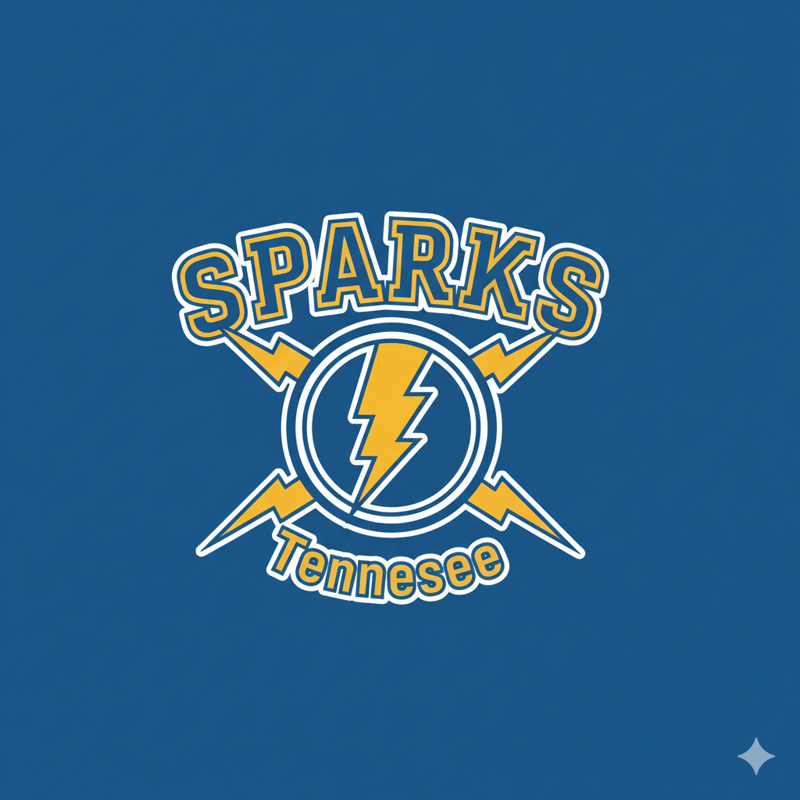

# Nashville Electrical Business Plan
## Mike Shaffer & Brendan Dauenhauer

---

## Executive Summary

A business plan for a residential electrical contracting company in Nashville, TN. A partnership between Mike Shaffer and Brendan Dauenhauer to create a professional electrical services firm with competitive pricing, strong operational systems, and a plan for sustainable growth.

**Key Financial Metrics:**
- Year 1 Startup Costs: $16,800
- Year 1 Revenue Projection: {year_1_revenue_projection} (First Crew)
- Year 1 Profit Projection: {year_1_profit_projection} (First Crew)
- Target: Scale to 4 crews within 12 months
- Year 1 Total Company Revenue Potential: {year_1_total_revenue_potential} (with all 4 crews)

---

## Market Analysis

### Target Market
Our primary target market is residential homeowners in the greater Nashville area, with a focus on middle to upper-middle-class neighborhoods where there is a higher demand for quality electrical work and smart home installations. We will also target small businesses and property management companies for recurring service contracts.

### Competitive Landscape
The Nashville electrical market is competitive. We will differentiate ourselves through:
*   **Superior Customer Service:** Clear communication, transparent pricing, and a focus on customer satisfaction.
*   **Specialization:** Expertise in high-demand areas like EV charger installations, solar panel systems, and smart home automation.
*   **Agility:** As a smaller company, we can be more responsive and flexible than larger competitors.

---

## Financial Projections Overview

### Monthly Revenue & Profit Comparison by Crew Count

| crew_count | monthly_revenue | monthly_costs | monthly_profit | profit_margin |
|---|---|---|---|---|
{monthly_revenue_table}

### Revenue Model by Crew Size

#### First Crew (Hired Technician, Mike's PM)
- **Annual Revenue:** {crew_1_annual_revenue}
- **Monthly Revenue:** {crew_1_monthly_revenue}
- **Total First Year Profit:** {crew_1_annual_profit}

**Crew Composition:**
- Hired Lead Technician: 30 hours/week at $30-50/hour base pay
- Mike: Project Manager & Business Operations
- Brendan: Investor/Business Partner
- Hours per week: 30 billable
- Hourly rate: $100
- Annual billable hours: 1,560
- Monthly billable: 120 hours

#### Second Crew (Growth Phase)
- **Annual Revenue:** {crew_2_annual_revenue}
- **Monthly Revenue:** {crew_2_monthly_revenue}
- **Monthly Costs:** {crew_2_monthly_costs}
- **Monthly Profit:** {crew_2_monthly_profit}

**Crew Composition:**
- Hours per week: 20
- Hourly rate: $100
- Annual billable hours: 1,040
- Monthly billable: 80 hours

#### Third & Fourth Crews
- Expanding capacity with similar operational models.
- Scaling labor costs and equipment expenses.
- Increasing profit margins as overhead distributes across multiple crews.

---

## Operating Expenses Breakdown

### Cost Structure Visualization

### Monthly Operating Costs Structure

{monthly_operating_costs_table}

### Key Expense Categories

#### Licensing & Insurance
- State electrical license
- Vehicle insurance
- Liability coverage

#### Vehicles
- First crew: $850/month (van lease/loan)
- Additional crews: $450/crew expansion cost
- Maintenance and fuel included

#### Marketing and Sales Strategy
- **Digital Marketing:** A professional website with online booking, targeted Google Ads, and an active social media presence on Facebook and Instagram to showcase our work and engage with the community.
- **Community Engagement:** Sponsoring local events and joining the Nashville Chamber of Commerce to build brand awareness and network with potential clients and partners.
- **Referral Program:** A structured referral program to incentivize word-of-mouth marketing from satisfied customers.
- **Initial Push:** The initial marketing push will leverage the personal and professional networks of Mike and Brendan to secure the first clients and build momentum.

#### Labor Costs
- **Technician:** $30/hour base rate, scales to $50 by month 12
- **Apprentice:** $22/hour base rate, grows with experience
- **Admin:** $12/hour for office operations
- **Project Manager:** $40/hour for crew oversight and client management

---

## Labor Structure & Billing Model

### Crew Composition by Growth Phase

#### Single Crew (Current)
- **Hired Lead Technician:** 30 hours/week in field ($30-50/hour base cost)
- **Mike Shaffer:** Project Manager & Business Operations
- **Brendan Dauenhauer:** Investor/Business Partner
- Hourly rate to clients: $100
- Labor cost to company: Technician base pay ($30-50/hour)
- Profit margin after labor: {crew_1_profit_margin}

#### Two Crew Model
- Crew 1: Technician + Apprentice (30 hours/week)
- Crew 2: Technician + Apprentice (20 hours/week)
- Mixed billing: $100-150/hour depending on complexity

#### Three Crew Model
- Technician/Apprentice pairs × 3
- Added project manager for scheduling and quality
- Added admin support (20 hours/week)

#### Four Crew Model
- Full operational team
- Project manager: Oversight of all crews
- Admin: Billing, scheduling, compliance
- Technician/Apprentice: 4 fully staffed crews

### Hourly Rate Strategy
- Service calls: $100/hour minimum
- Project work: $100-150/hour based on complexity
- Apprentice-led jobs: $75/hour (lower complexity)
- Premium services: Up to $200+/hour for specialized work

---

## Management Team

### Mike Shaffer - Operations Manager
With over 15 years of experience as a licensed electrician and project manager, Mike brings a wealth of technical expertise and a deep understanding of the electrical contracting industry. His hands-on experience ensures the highest quality of work and efficient project execution.

### Brendan Dauenhauer - Business Manager
Brendan has a background in business administration and finance. His expertise in financial planning, marketing, and business development will drive the company's growth and ensure its long-term financial health.

---

## Revenue Projections by Scenario

### 1 Crew Monthly Scaling

| Month | Hours | Rate | Revenue | Costs | Profit |
|---|---|---|---|---|---|
| Month 1 | 120 | $100 | $12,000 | $1,206 | $10,794 |
| Month 3 | 120 | $100 | $12,000 | $1,206 | $10,794 |
| Month 6 | 120 | $110 | $13,200 | $1,206 | $11,994 |
| Month 12 | 120 | $125 | $15,000 | $1,206 | $13,794 |
| **Annual Total** | **1,560** | **$100** | **$252,000** | **$14,472** | **$13,589** |

### 2 Crew Scenario (By Month 4-6)
- Total Monthly Revenue: {crew_2_monthly_revenue}
- Total Monthly Costs: {crew_2_monthly_costs_total}
- Monthly Profit: {crew_2_monthly_profit}
- Annual Profit (8 months): {crew_2_annual_profit_8_months}

### 3 Crew Scenario (By Month 8-10)
- Total Monthly Revenue: {crew_3_monthly_revenue}
- Total Monthly Costs: {crew_3_monthly_costs_total}
- Monthly Profit: {crew_3_monthly_profit}
- Represents {crew_3_profit_margin} net margin during growth phase

### 4 Crew Full Operation
- Total Monthly Revenue: {crew_4_monthly_revenue}
- Total Monthly Costs: {crew_4_monthly_costs_total}
- Monthly Profit: {crew_4_monthly_profit}
- Represents {crew_4_profit_margin} net margin with all crews operational

---

## Startup & Implementation Costs

### Initial Investment: $16,800

| Item | Cost |
|---|---|
| Van/Vehicle | $600 |
| Tools & Equipment | $7,000 |
| Business License & Permits | $1,400 |
| Insurance (3 months) | $900 |
| Marketing/Branding Setup | $2,000 |
| Office Setup & Software | $1,500 |
| Working Capital Reserve | $3,400 |
| **Total** | **$16,800** |

### Break-Even Timeline
- First crew reaches break-even: Month 2-3
- Company break-even with 2 crews: Month 5-6
- Company positive cash flow (3+ crews): Month 10+

---

## Implementation Timeline & Milestones

### 12-Month Implementation Timeline

### Phase 1: Foundation & Launch (Weeks 1-4)
**Status: In Progress**

- [ ] Get state business license
- [ ] Get state electrical contractor license
- [ ] Get city business licenses
- [ ] Get comprehensive insurance coverage
- [ ] Set up business banking and accounting (Quickbooks)
- [ ] Secure service vehicle (van lease or purchase)
- [ ] Procure essential tools and equipment

**Target Completion:** Week 4

### Phase 2: Brand & Marketing Setup (Weeks 3-6)
- [ ] Create company branding (logo, colors, messaging)
- [ ] Build professional website
- [ ] Set up social media presence
- [ ] Create business cards and marketing materials
- [ ] Wrap/brand service vehicle

**Target Completion:** Week 6

### Phase 3: Operations & Service Delivery (Weeks 4-8)
- [ ] Create onboarding docs and standard operating procedures
- [ ] Develop company documentation
- [ ] Set up customer communication systems
- [ ] Establish project management and scheduling workflow
- [ ] Create service templates and pricing guides

**Target Completion:** Week 8

### Phase 4: Client Acquisition (Weeks 6-12)
- [ ] Reach out to existing clients and networks
- [ ] Generate first 5-10 jobs to establish momentum
- [ ] Collect testimonials and case studies
- [ ] Implement referral program

**Target Completion:** Week 12

### Phase 5: Team Expansion (Month 3-6)
- [ ] Recruit second technician and apprentice
- [ ] Train new crew on company standards
- [ ] Establish project management processes for 2 crews
- [ ] Add admin support

**Target Completion:** Month 6

### Phase 6: Scaling & Optimization (Month 6+)
- [ ] Recruit and train third crew
- [ ] Hire full-time project manager
- [ ] Optimize labor scheduling and resource allocation
- [ ] Plan for fourth crew addition
- [ ] Evaluate performance metrics and profitability

**Target Completion:** Month 12

---

## To-Do List Status

### Licensing & Legal (Priority: CRITICAL)
- [ ] Get state business license
- [ ] Get state electrical contractor license
- [ ] Get city business licenses
- [ ] Get insurance

### Operations Setup (Priority: HIGH)
- [ ] Buy van or secure vehicle lease
- [ ] Get phone line for business
- [ ] Set up Gmail/business email
- [ ] Get Quickbooks for accounting
- [ ] Obtain service van license/registration

### Team & Administration
- [ ] Hire apprentice/second technician
- [ ] Set up onboarding docs and flow
- [ ] Create company documentation

### Marketing & Brand (Priority: HIGH)
- [ ] Make branding (logo, company identity)
- [ ] Make website
- [ ] Make social media presence
- [ ] Wrap van with branding
- [ ] Start marketing campaigns

### Customer Acquisition (Priority: MEDIUM)
- [ ] Reach out to existing clients
- [ ] Reach out to community
- [ ] Get first service calls booked
- [ ] Build referral pipeline

### Tools & Equipment
- [ ] Buy essential electrical tools
- [ ] Get safety equipment
- [ ] Vehicle equipment and organization

---

## Break-Even Analysis

### First Crew Break-Even Timeline

### Monthly Cash Flow Analysis

Month 1: Revenue {crew_1_monthly_revenue} - Costs {crew_1_monthly_costs} = +{crew_1_monthly_profit} profit
         (Minus $16,800 startup = {month_1_net} net)

Month 2: Revenue {crew_1_monthly_revenue} - Costs {crew_1_monthly_costs} = +{crew_1_monthly_profit} profit
         (Cumulative: {month_1_net} + {crew_1_monthly_profit} = {month_2_cumulative})

Month 3+: Steady +${crew_1_monthly_profit}/month profit

### Annual Cash Flow Projection

Startup Investment:           -$16,800
Year 1 Total Profit:          +{year_1_profit_projection}
Adjusted Year 1 Net:          {year_1_net_profit}
Year 2 Projection:            +$164,000+

---

## Financial Health Indicators

### Key Performance Metrics to Track

#### Monthly Metrics
- **Billable Hours:** Track actual hours vs. 30/20 target
- **Average Hourly Rate:** Monitor if hitting $100-125/hour targets
- **Labor Cost %:** Keep below 40% of revenue
- **Customer Acquisition Cost:** Track marketing efficiency
- **Job Completion Rate:** Target 95%+ on-time completion

#### Quarterly Metrics
- **Gross Profit Margin:** Target 60-70% after direct labor
- **Net Profit Margin:** Target 15-25% after all expenses
- **Crew Utilization:** Target 80%+ billable hours
- **Customer Retention:** Track repeat business %
- **Average Job Value:** Monitor pricing effectiveness

#### Annual Metrics
- **Year 1 Revenue:** Target {year_1_revenue_target} (1-2 crews)
- **Year 2 Revenue:** Target $600K-$1M (2-3 crews)
- **Year 3 Revenue:** Target $1.5M+ (4+ crews)
- **ROI on Initial Investment:** Target 800%+ by end of year 1

---

## Risk Mitigation Strategies

### Cash Flow Risk
- Maintain $10K+ working capital reserve
- Invoice immediately upon job completion
- Offer small discounts for quick payment
- Track receivables closely

### Crew Dependency Risk
- Cross-train technicians
- Document all processes and procedures
- Build strong apprenticeship program
- Maintain bonus structure for retention

### Market Competition Risk
- Differentiate through superior customer service
- Build strong local reputation and referral network
- Focus on niche services
- Maintain competitive but profitable pricing

### Seasonal Variability
- Build financial reserves during high season
- Develop winter maintenance/upgrade service offerings
- Plan marketing to smooth demand across seasons

---

## Success Metrics & Milestones

### Month 1-2: Foundation
- ✓ All licenses and insurance obtained
- ✓ Van secured and branded
- ✓ Website and social media live
- ✓ First 3-5 jobs booked

### Month 3: Early Traction
- ✓ {month_3_revenue_milestone} monthly revenue established
- ✓ 5+ completed jobs with testimonials
- ✓ Positive cash flow achieved
- ✓ Apprentice or second team member recruited

### Month 6: Expansion Ready
- ✓ {month_6_revenue_milestone} monthly revenue (1.5 crews)
- ✓ Second crew added
- ✓ Documented processes and training materials complete
- ✓ 20+ satisfied customers with referral pipeline

### Month 12: Full Operation
- ✓ {month_12_revenue_milestone} monthly revenue (3-4 crews)
- ✓ All 4 crews operational
- ✓ {year_1_profit_milestone} annual profit achieved
- ✓ Company systems and team established for scaling

---

## Next Steps

### Immediate (This Week)
1. Confirm partnership structure and ownership split
2. Finalize startup budget and secure funding
3. Begin licensing application process
4. Schedule insurance quote meetings

### Next 2 Weeks
1. Complete all licensing applications
2. Secure vehicle
3. Hire initial team members
4. Set up business accounting system

### Next Month
1. Launch branding and website
2. Start customer outreach campaigns
3. Establish operational procedures
4. Book first service calls

---

**Document Version:** 1.2
**Last Updated:** October 29, 2025
**Next Review:** November 30, 2025